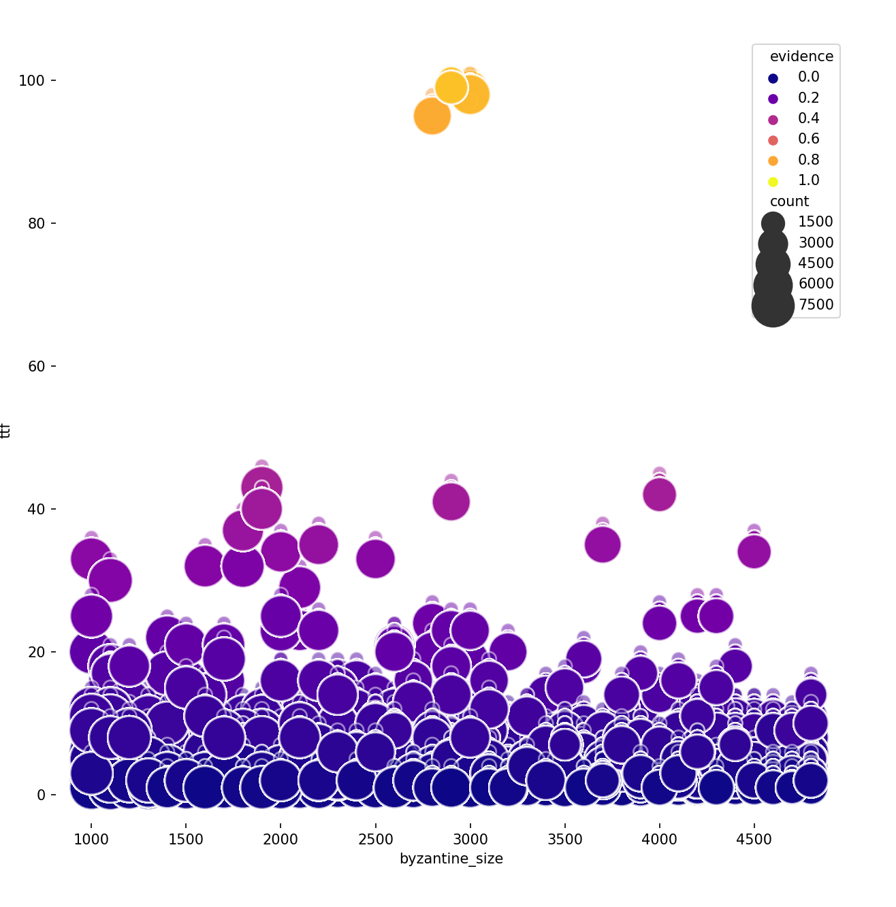

# Time to finality results

## Near bivalent experiment

### Representation guide

`X` Axis: **alpha** value

`Y` Axis: **ttf** (rounds till experiment stabilized or reach a bivalent state)

`Count size`: number of nodes (non byzantine)

`Evidence`: normalized color range from 0 to max evidence found 

## Byzantine experiments

### Representation guide

`X` Byzantine size: Number of byzantine nodes

`Y` Axis: **ttf** (rounds till experiment stabilized or reach a bivalent state)

`Count size`: number of nodes (non byzantine)

`Evidence`: normalized color range from 0 to max evidence found

## Omniscient

## Infantile

## Random

